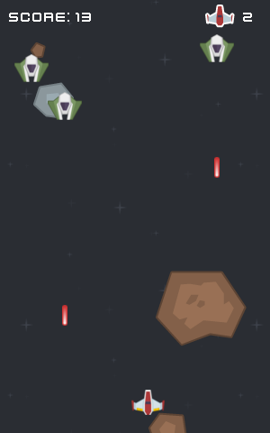

# spacebattle
Project:  An old project using SDL2

Goal: Get as far as you can.

Scoring:
- Kill an enemy: 1 point
- Parry a projectile: 3 points
- Kill a full wave: 10 points



# Quick Start

```console
$ make -j4
$ ./spacebattle
```

# Controls (AZERTY Layout)

| keyboard   | action                                  |
|------------|-----------------------------------------|
| Left/Right | move the player                         |
| Space      | shoot a laser                           |
| S          | parry a projectile (can't parry a ship) |
